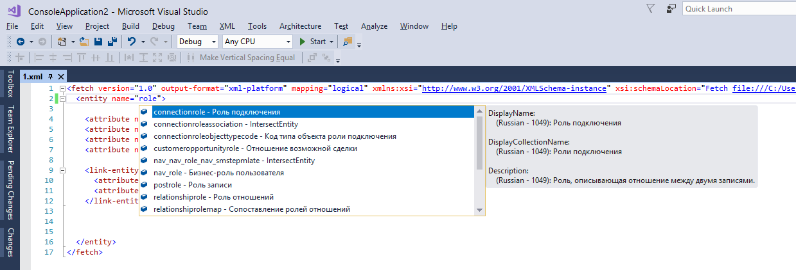
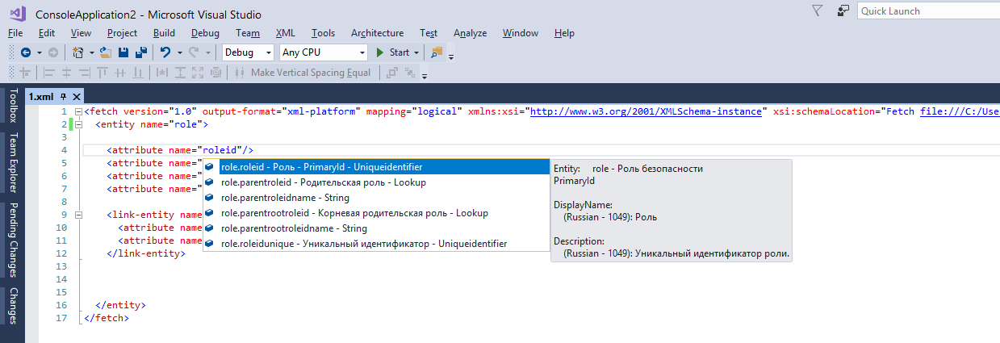
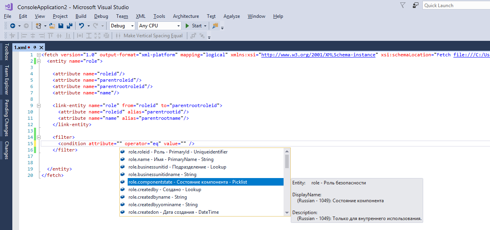
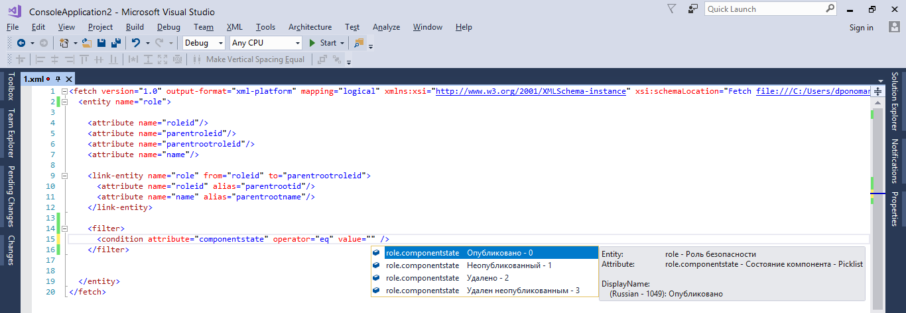
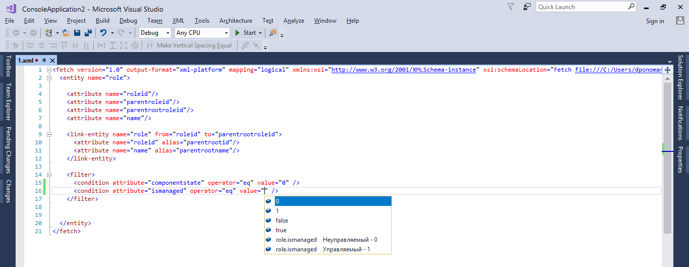
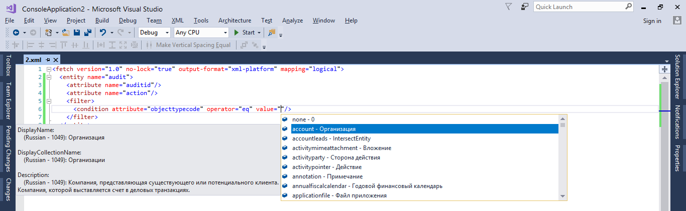
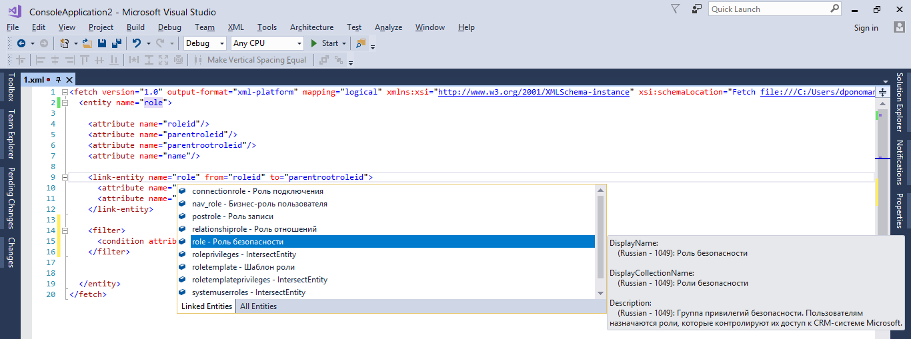
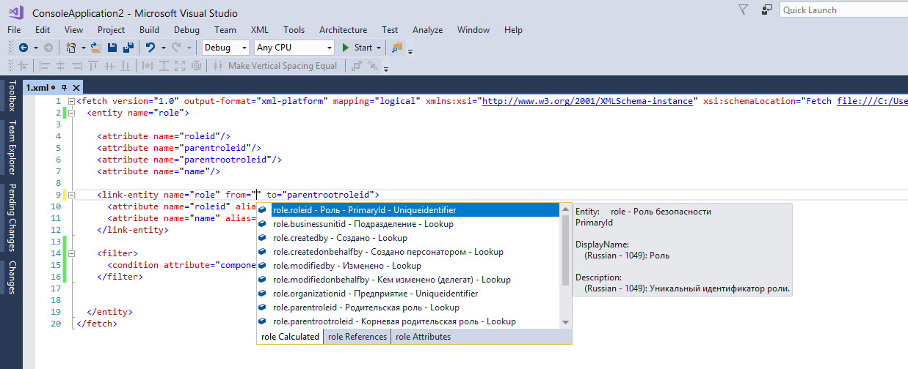
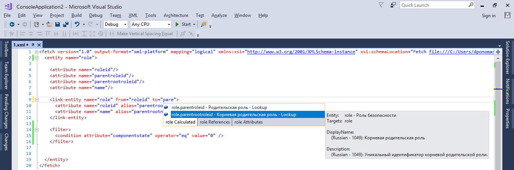

# CrmDeveloperHelper for Visual Studio

Download this extension from the [VS Marketplace](https://marketplace.visualstudio.com/items?itemName=NaviconPonomarevDmitry.CrmDeveloperHelper).

---------------------------------------

## Features

- **Intellisense in Xml Editor**
  - for Fetch (fetchxml, layoutxml)
  - for Ribbon (ribbonxml, ribbondiffxml)
  - for SiteMap
- **FetchExecutor**
- **GoToDefinition** for Ribbon Commands and Rules (ribbonxml, ribbondiffxml)
- **WebResources**
- **Reports**
- **Plugins**
- **Extracting Entity information for CRM**
  - Entity Metadata
  - Forms
  - Views
  - Charts
  - Ribbons
  - Workflows
  - Global OptionSets
  - Plugin Information
- **Comparing CRM Organizations**

### Intellisense for Fetch
  - session for entity name

  - session for entity attribute

  - session for condition attribute

  - session for picklist attribute value

  - session for boolean attribute value

  - session for entity name attribute value

  - session for link-entity name

  - session for link-entity from attribute

  - session for link-entity to attribute

### FetchExecutor

## License
[Apache 2.0](LICENSE)
